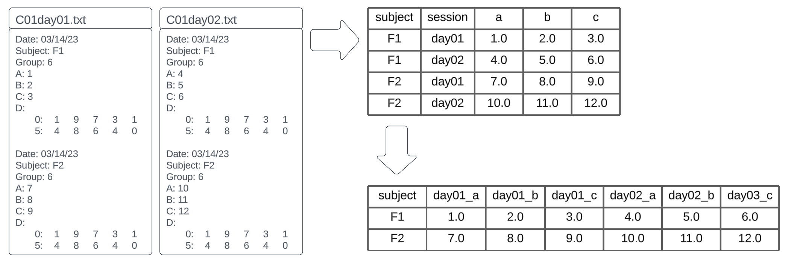

# PMEDPC
A tool to extract data from MedPC files and write to csv.

# INSTALL

python -m pip install --user git+https://github.com/Palmer-Lab-UCSD/pmedpc.git@v0.0.2

python -m pip uninstall pmedpc

# EXAMPLES

python -m pmedpc <file_path>

python -m pmedpc <directory_path>

python -m pmedpc ALCOHOLGWAS_C03_R1_FEMALES_DAY01

python -m pmedpc "C04 Females"

python -m pmedpc pmedpc/folder

python -m pmedpc pmedpc/test

Data extraction workflow: 

# Versions

v0.0.1: input file and outputs csv

v0.0.2: input file can be folder, separating bins in output csv
